# AWS DeepRacer ハンズオン

## （事前作業）この作業は皆さまが持っているAWSのアカウントでは発生しない作業です

事前に配布された URL に Google Chrome もしくは Firefox
でアクセスします。すでに AWS
を使ったことがある方はシークレットモードでアクセスすることをおすすめします。

16桁のハッシュがテキストボックスに入力されていることを確認して、「Accept
Terms & Login」をクリックします。

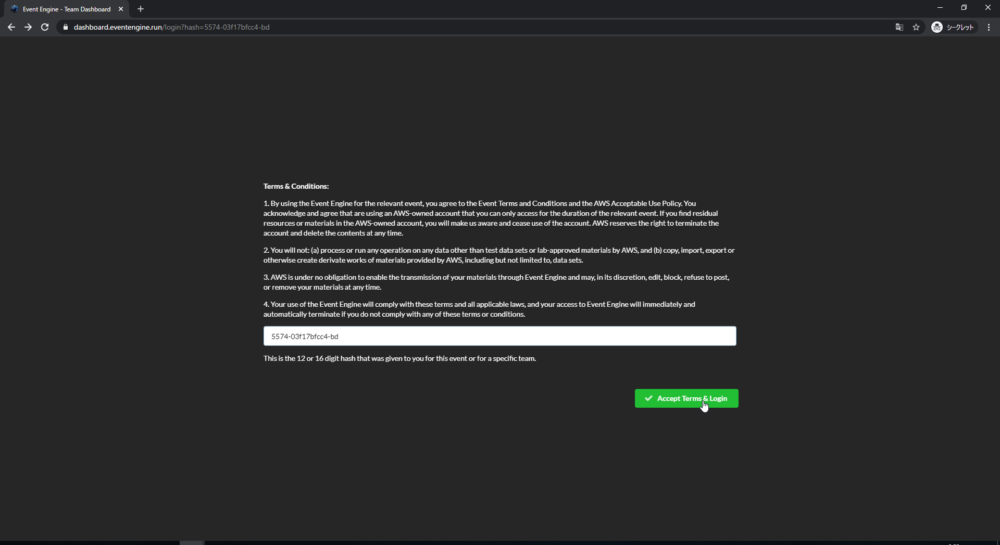

「AWS Console」をクリックします。

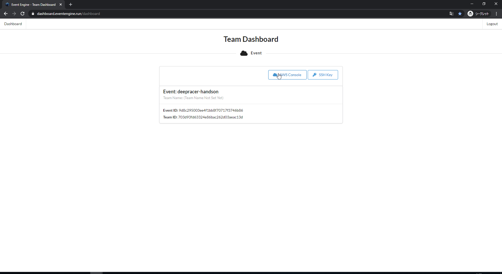

「Open AWS Console」をクリックします。

## ハンズオンスタート

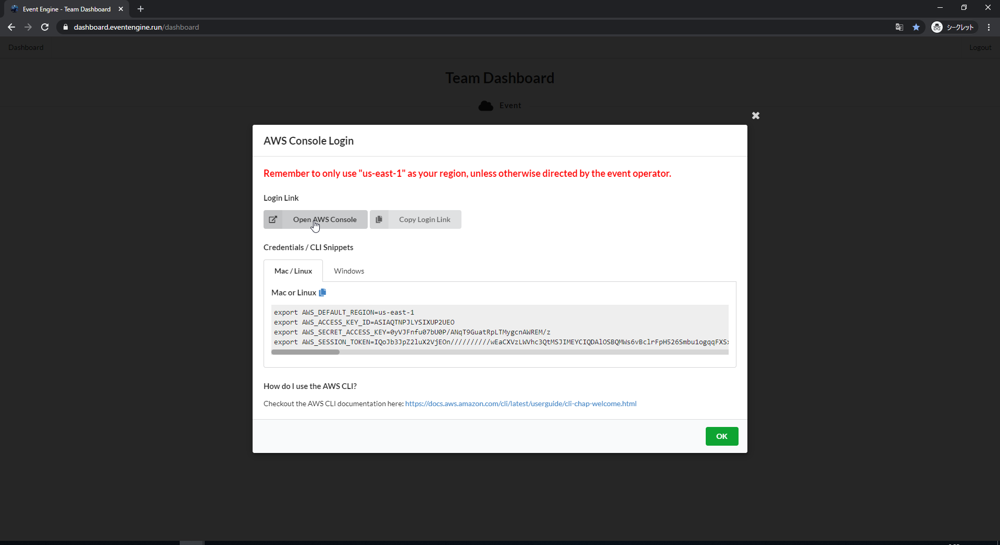

サービスのテキストボックスに「DeepR」と打ち込み、表示される「AWS
DeepRacer」をクリックします。

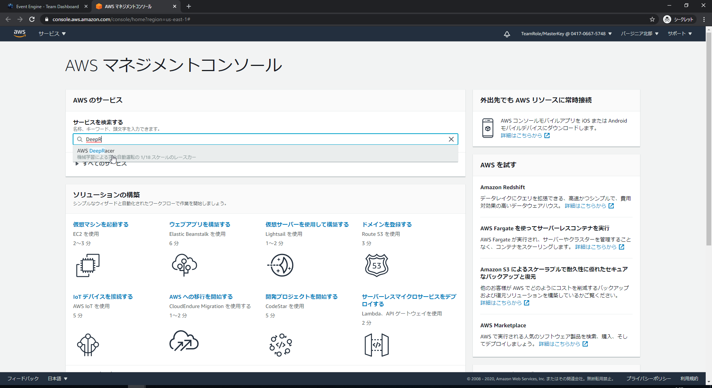

Your garage をクリックします。

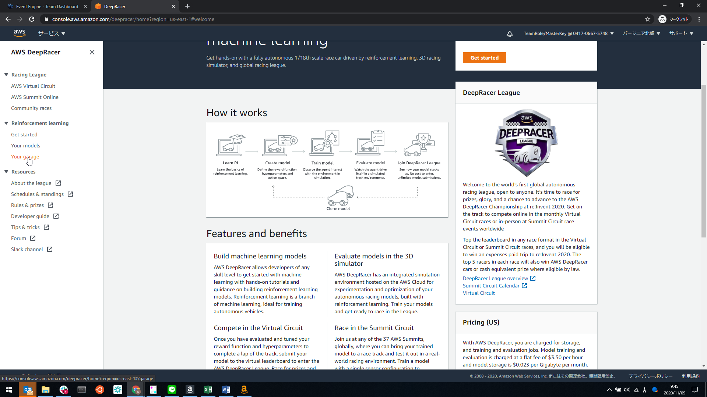

画面にチュートリアルがポップアップで表示されます。読んでいただいてもいいですし、「xボタン」でスキップしていただいても構いません。

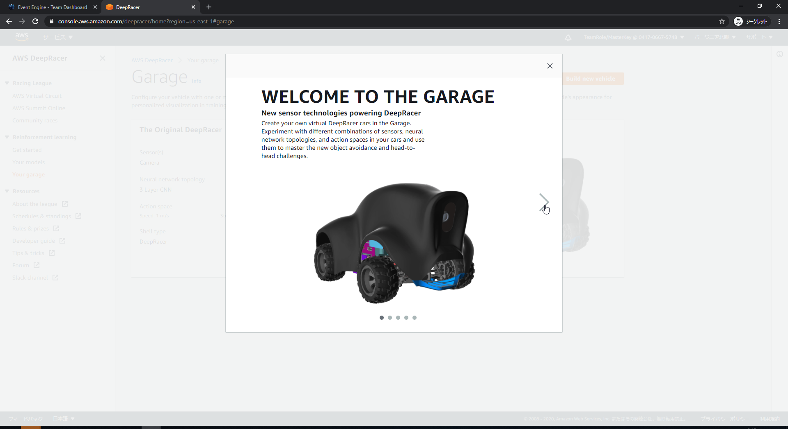

「Build new vehicle」をクリックします。

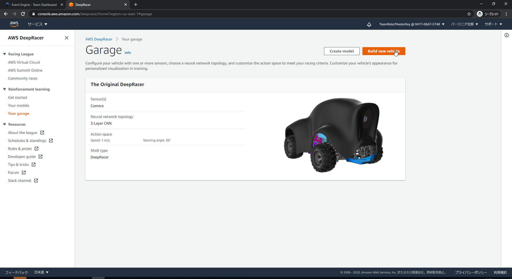

「Camera」のラジオボタンをクリックして、「Next」をクリックします。

補足

* タイムトライアルレースで 1 台の車だけ走らせたい場合は、Camera(シングルレンズのカメラ)の使用を検討してください。他の車や障害物がない状態でトラックをレースするには、複雑な入力データは必要ありません。つまり、トレーニングが複雑になるほど、トレーニング時間が長くなります。
障害物回避レースモデルまたは直接対決レースモデルを構築する場合は、Stereo camera（立体視カメラ）センサーの使用を検討してください。モデルがイメージから深度機能を学習するように、報酬関数を使用する必要があります。これは立体視カメラで行えます。直接対決レースモデルでは、立体視カメラでは死角をカバーできない場合があります。
* 直接対決レースに参加する場合は、モデルに LIDAR を追加することを検討してください。LIDAR センサーは後方を向いており、車両から約 0.5 m までスキャンします。曲がる際に死角にいる車、または背後から近づいている車を検出します。

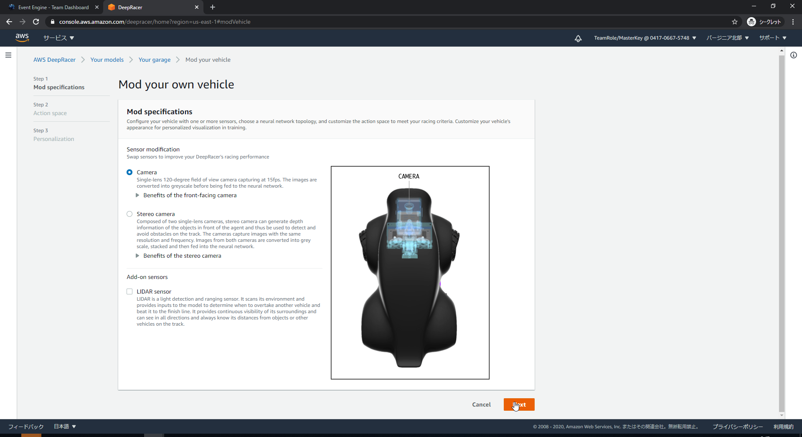

ここでは、トレーニング中にモデルが使用するアクションスペースを設定します。モデルが特定のアクションスペースでトレーニングされると、コンソールでアクションスペースを変更することはできません。ネットワークの最後のレイヤーであり、具体的には出力ノード数が固定されるためです。アクションとは、速度とステアリング角度の組み合わせのことです。AWS DeepRacer では、継続的なアクションスペースではなく、個別のアクションスペースを使用しています。この個別のアクションスペースを構築するには、最大ステアリング角度、ステアリング角度の粒度、最大速度、および速度の粒度を指定します。本ワークショップでのアクションスペースの入力データは次のとおりです。

* Maximum steering angle（最大ステアリング角度）は、自動車の前輪が左右に回すことができる最大角度（度数）です。車輪が回転できる距離に制限があるため、最大回転角度は 30 度です。最大ステアリング角度を 30 度に設定してください。
* Steering angle granularity（ステアリング角度の粒度）とは、両側の最大ステアリング角度間のステアリング間隔の数を指します。 したがって、最大ステアリング角度が 30 度の場合、+30 度は左に、-30 度は右になります。ステアリングの粒度が 5 の場合、左から右へのステアリング角度は 30 度、15 度、0 度、-15 度、-30 度になります。ステアリング角度は常に 0 度前後に対称です。ステアリング角度の粒度を 5 に設定してください。
* Maximum speed（最高速度）は、1 秒あたりのメートル数で測定された、シミュレーターで車両が運転する最大速度を指します。最大速度を 1 m/ 秒 に設定してください。 速度が速いほど、トレーニングに時間がかかります。以下の画像をご覧ください
* Speed granularity（速度の粒度）とは、最大速度（を含む）からゼロ（を除く）までの速度レベルの数です。したがって、最大速度が 3 m/ 秒、速度の粒度が 3 の場合、アクションスペースには 1 m/ 秒、2 m/ 秒、3 m/ 秒の速度設定が含まれます。3 m/ 秒を 3 で割ると 1 m/ 秒単位になるため、0 m/ 秒（除外）から 3 m/ 秒単位で 1 m/ 秒単位にします。速度の粒度を 3 に設定してください。

[ご参考](https://deepracer-jp.workshop.aws/2_handson/2_2/2_2_2.html#アクションスペース)
一旦先にすすめてもらって、後で参考URLを見ていただくとよいかと思います。

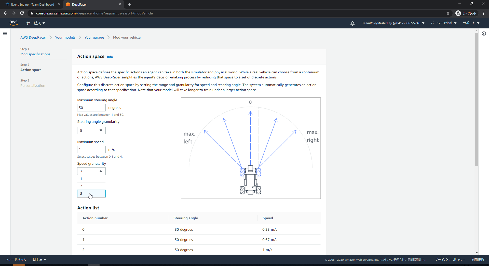

下にスクロールして、「Next」をクリックします。

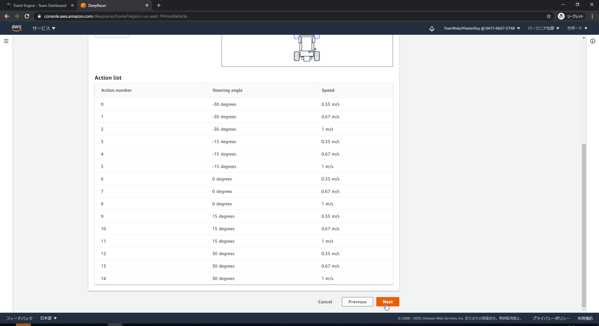

Vehicle に適切な名前をつけて、「Done」をクリックします。

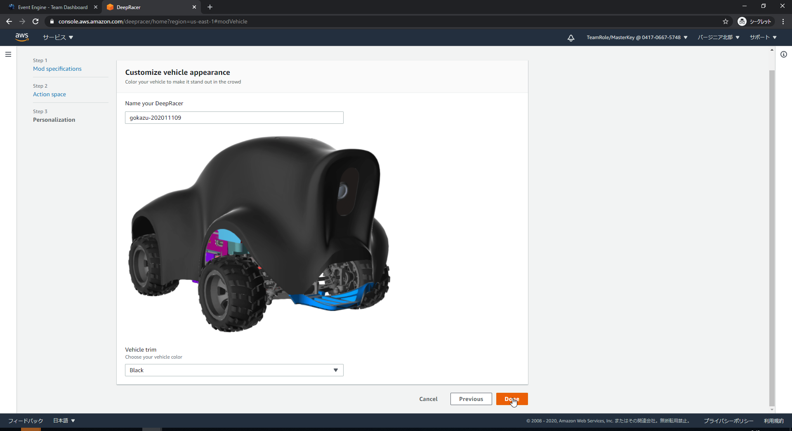

左側のペインから「Your models」をクリックします。

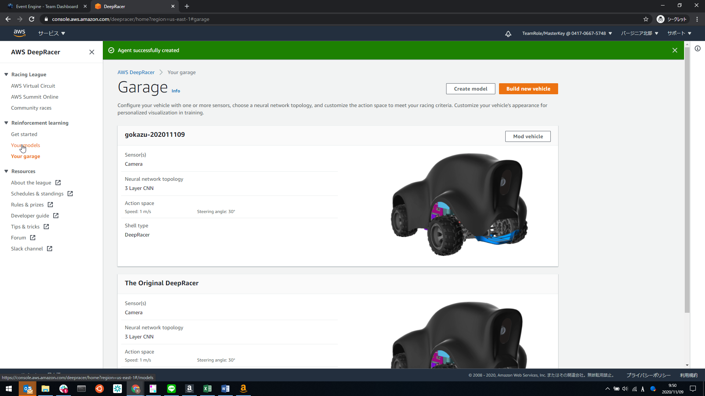

「Create model」をクリックします。

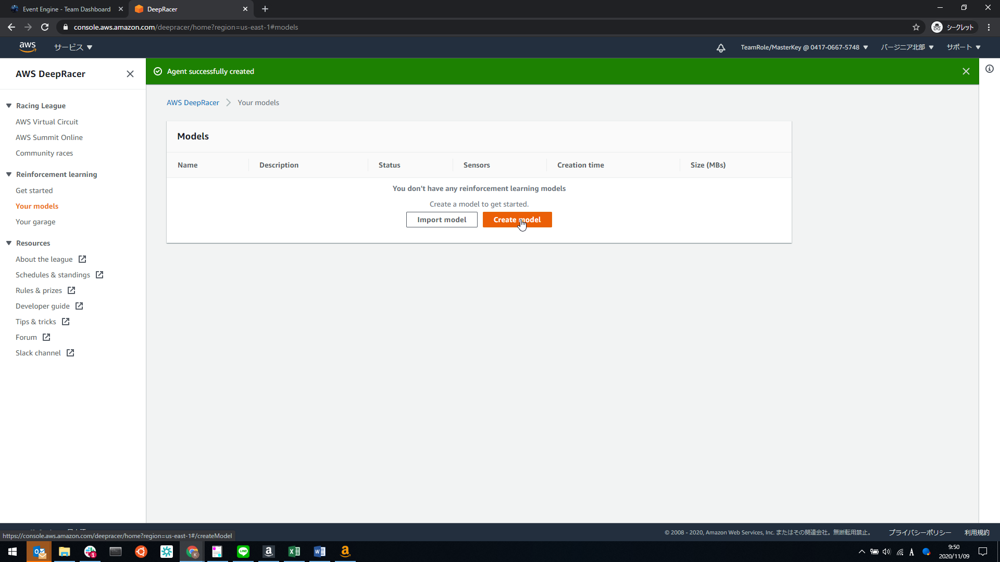

「Model Name」に適切な名前を入力します(ex:MyFirstModel)

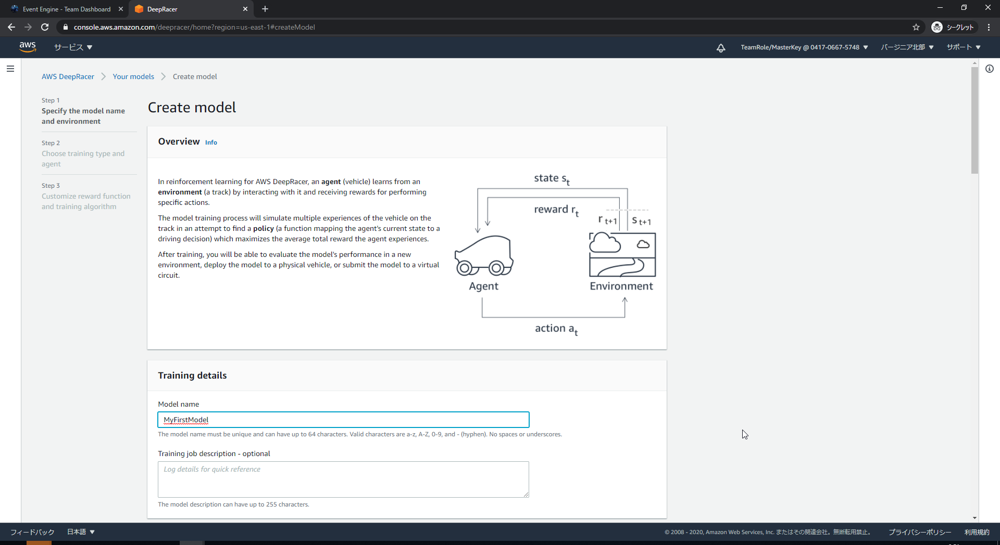

「The 2019 DeepRacer Chanpionship Cup」を選択します。

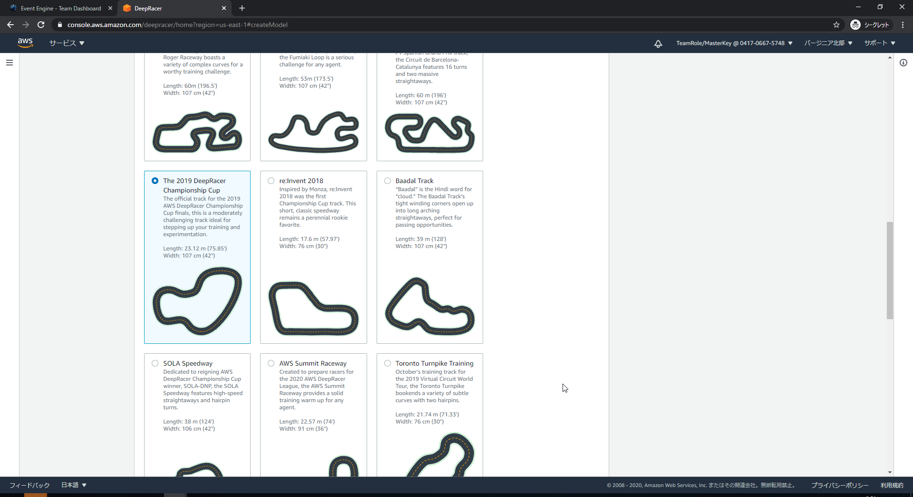

「Next」をクリックします。

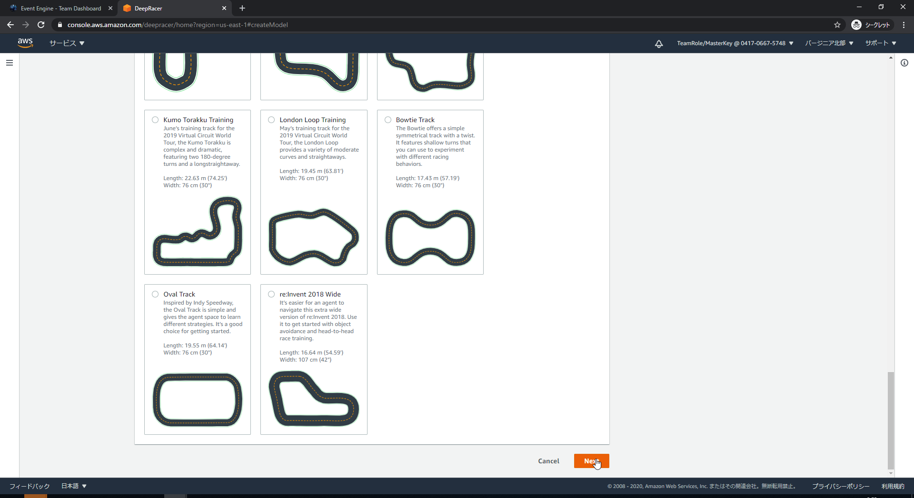

「Time
Trial」を選択し、Agentに先程作成したVehicleを選んで「Next」をクリックします。

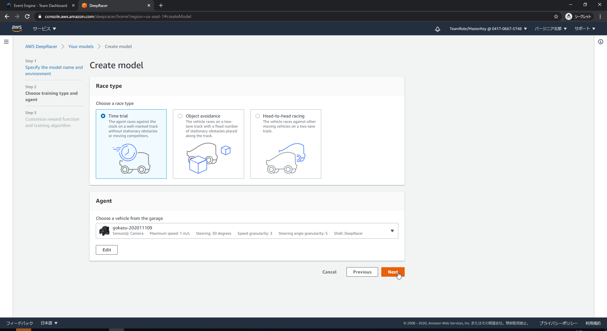

報酬関数を設定します。初回実行はデフォルトのまま「Validate」をクリックし、有効かどうかを確認します。
[ご参考](https://deepracer-jp.workshop.aws/2_handson/2_2/2_2_6.html#reward-function-報酬関数)
一旦先にすすめてもらって、後で参考URLを見ていただくとよいかと思います。

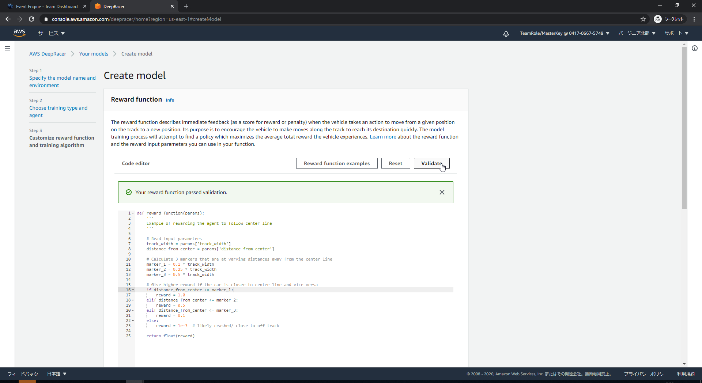

Hyperparamaters の部分は初回はデフォルトのままで良いです。
[ご参考](https://deepracer-jp.workshop.aws/2_handson/2_2/2_2_7.html#ハイパーパラメータ)
「Stop conditions」 を 20 minutes にして「Create model」
をクリックします。(ハンズオンの時間をオーバーしてしまうため。本来は120分以上が望ましいです)

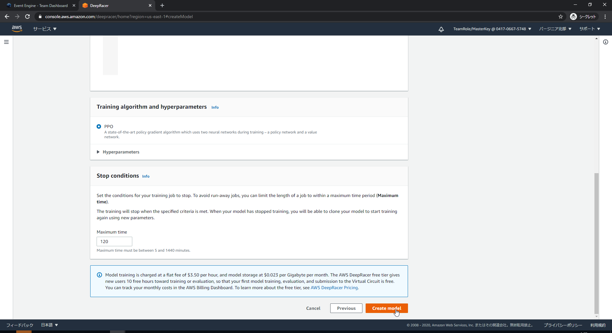

モデルの学習がスタートします。

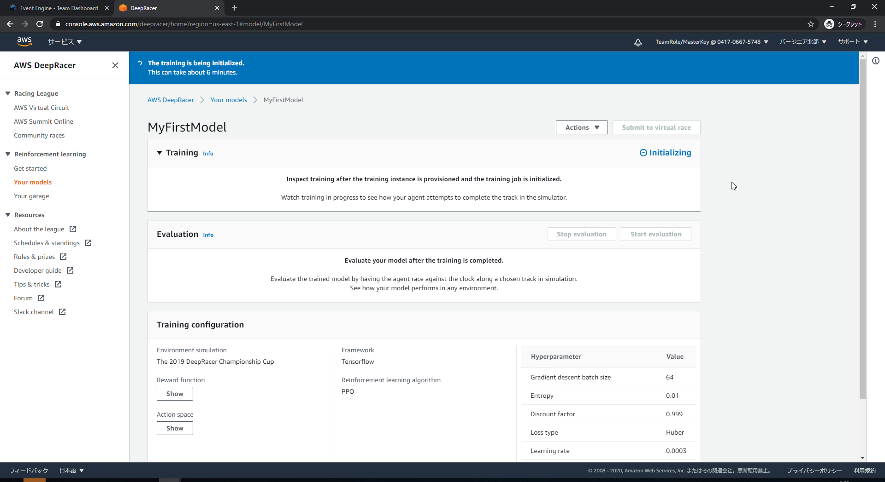

しばらくすると学習の様子が動画で再生され始めます。

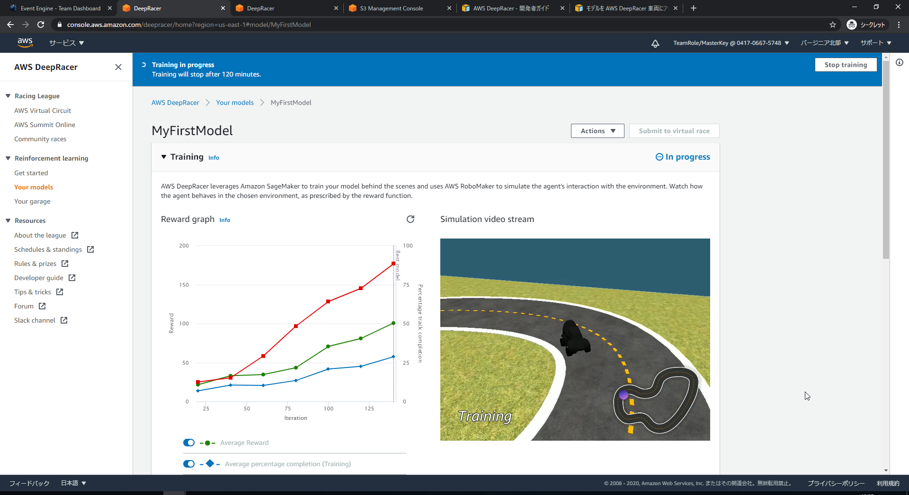

完了しました。トレーニングが進むに従って得る報酬が増え、完走に近くなっていることがわかるかと思います。
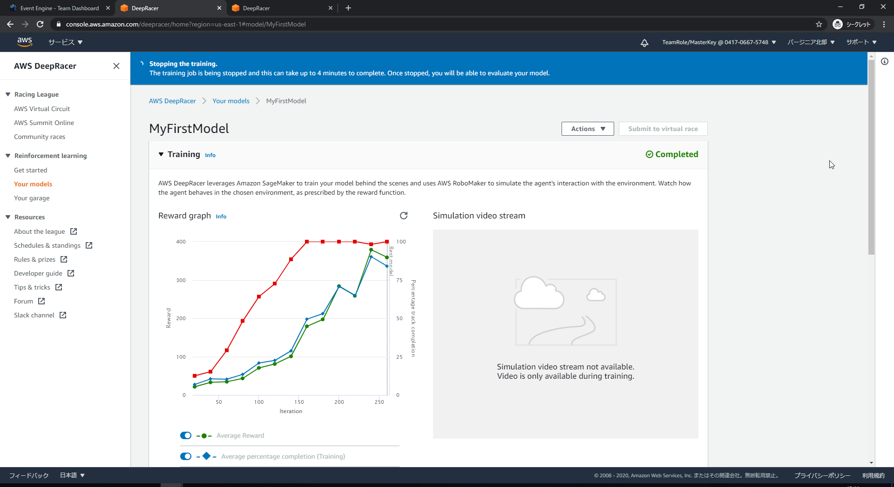

モデルの改善を試みる方は[こちらのURL](https://deepracer-jp.workshop.aws/2_handson/2_4.html)をご参照ください。

また、フォーラムが活発に動いておりますのでこちらも参考にしていただけると、最新情報が手に入ります。（DeepRacerサービス自体の開発が大変活発で、このハンズオンドキュメントもいつ古新聞になるかわかりません）
[フォーラム](https://forums.aws.amazon.com/forum.jspa?forumID=318)

フォーラムはDeepRacerのサービス画面のペインのリンクからも飛ぶことができます。
その並びにある Developer guide なども有用な情報源でございますので、ぜひご参照ください。

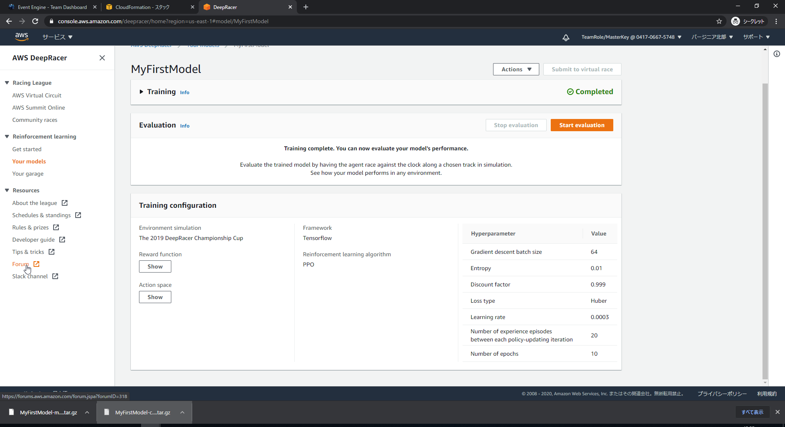

## リソースの削除

本日の環境は24時間後に自動で削除されますので、気にする必要はありませんが、貴社環境で実施する際のリソースの削除手順です。

作成したモデルの学習が完了した状態で、「Actions」から「Delete」を選択します。
モデルを開いていない場合は 「DeepRacer」 の左側のペインから 「Your models」 をクリックし、学習したモデル名をクリックすると出てきます。

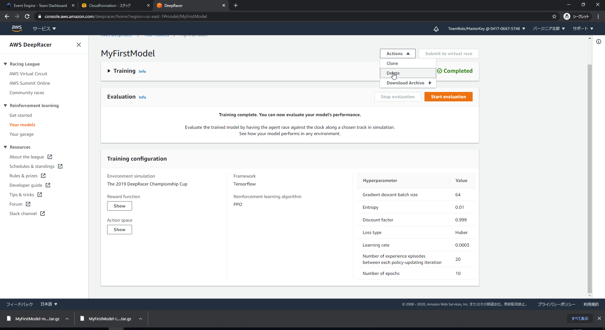

以上です。

2020/11/09 動作確認済